# CVE-2023-35671
Android App Pin security issue exposes payment cards in Google Wallet to unauthorized payments.

# Table of Contents
- [CVE-2023-35671](#cve-2023-35671)
- [Table of Contents](#table-of-contents)
- [What is Android App Pinning?](#what-is-android-app-pinning)
- [About the issue](#about-the-issue)
- [Getting Started](#getting-started)
  - [Prerequisites](#prerequisites)
  - [Proof of Concept](#proof-of-concept)
    - [Full PoC video](#full-poc-video)
    - [PoC step-by-step using screenshots](#poc-step-by-step-using-screenshots)
- [Documentation](#documentation)
- [Authors](#authors)
- [Disclaimer](#disclaimer)
- [License](#license)

# What is Android App Pinning?
Android app pinning, initially known as 'screen pinning', was introduced with Android 5.0 Lollipop (API level 21), released on November 12, 2014. This robust security mechanism enhances user control, privacy, and data security on Android devices.

App pinning empowers users to confine their device to a single app, effectively limiting access to other applications and sensitive information. This functionality proved invaluable in scenarios where sharing a device, interacting with public terminals, or maintaining a highly focused work environment was essential. By doing so, it prevents unauthorized access to personal data, applications, and settings, contributing to an overall more secure digital experience.

The process of utilizing app pinning typically involves the following steps:

1. **Enabling App Pinning**: Users can activate this feature through their device settings (`Settings` --> `Security & privacy` --> `More security settings` --> `App pinning`). Once enabled, they can select the app they wish to pin.
2. **Entering Pinned Mode**: Upon launching the desired app, users initiate the pinning process. This action locks the device into the selected app's interface.
3. **Restricted App Interaction**: While in pinned mode, all other apps become temporarily inaccessible. Attempts to switch to another app, access notifications, or perform other functions will prompt the device to remain within the pinned app.
4. **Exiting Pinned Mode**: To exit this mode, users typically need to provide an additional layer of authentication, such as entering a pre-set PIN, pattern, password, or using biometric recognition (like fingerprints or facial recognition). This extra layer ensures that only authorized users can leave the pinned app environment.

Benefits of Android app pinning include:

- **Privacy and Security**: Pinned mode prevents unauthorized access to personal data, sensitive applications, and confidential information.
- **Public Terminals**: App pinning proves useful in situations like kiosks or shared devices, as it restricts users to a specific application, minimizing the risk of unauthorized access and data exposure.
- **Focus and Productivity**: Users can create focused work environments by limiting their device's capabilities to a single task-oriented application.
- **Parental Controls**: Parents can utilize app pinning to restrict their children's device usage to specific educational or age-appropriate apps.

In summary, Android app pinning, previously known as 'screen pinning', was introduced with Android 5.0 Lollipop and provides granular control over device functionality and access. By designating a specific app for use and requiring authentication to exit that mode, it offers enhanced security, privacy, and focused engagement with digital content.

# About the issue
In `onHostEmulationData` of `HostEmulationManager.java`, there is a possible way for a general purpose NFC reader to read the full card number and expiry details when the device is in locked screen mode due to a logic error in the code. This could lead to local information disclosure with no additional execution privileges needed. User interaction is not needed for exploitation.[REF](https://nvd.nist.gov/vuln/detail/CVE-2023-35671)

Google has calculated a high severity for this vulnerability.

# Getting Started
Through the following PoC you can test this vulnerability on your Android smartphone.

## Prerequisites
- Android smartphone;
- App Pinning functionality, with the option `Ask for PIN before unpinning`, must be enabled in system settings;

  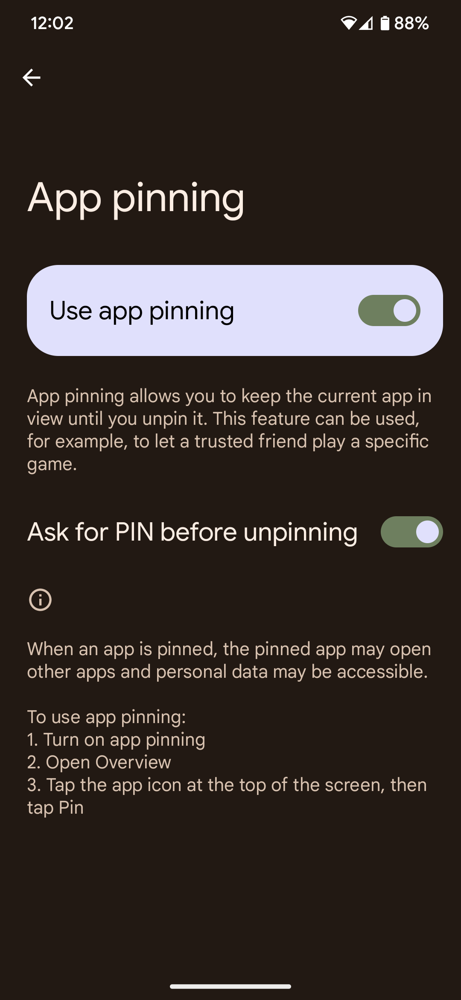

- At least one payment card configured in Google Wallet;

  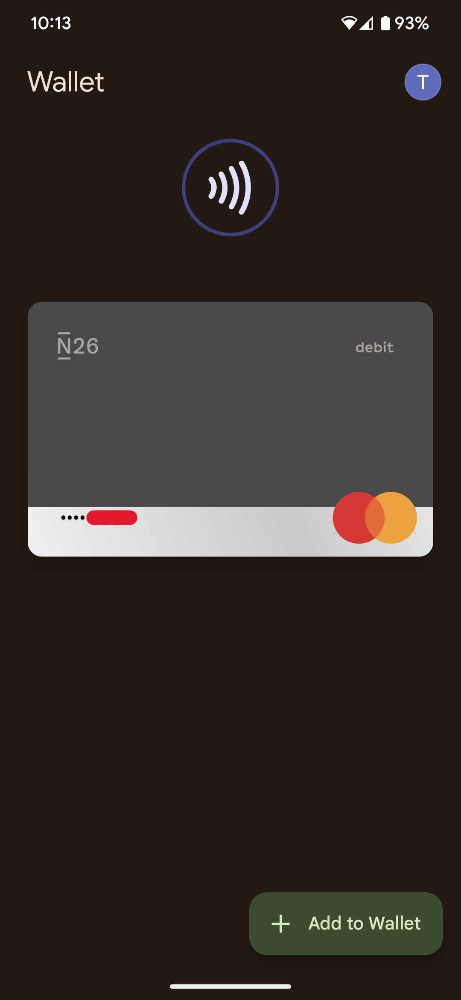

- An NFC reader for payment cards, e.g. **[Flipper Zero](https://flipperzero.one)**.

  

- NFC, with the option `Require device unlock for NFC`, must be enabled on the smartphone.

  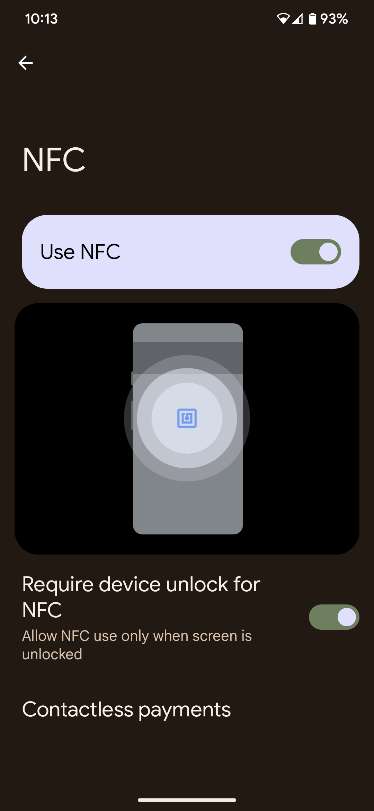

## Proof of Concept
A `Google Pixel 7 Pro` running Android 13 was used for this PoC; all builds released before September 2023 are vulnerable:

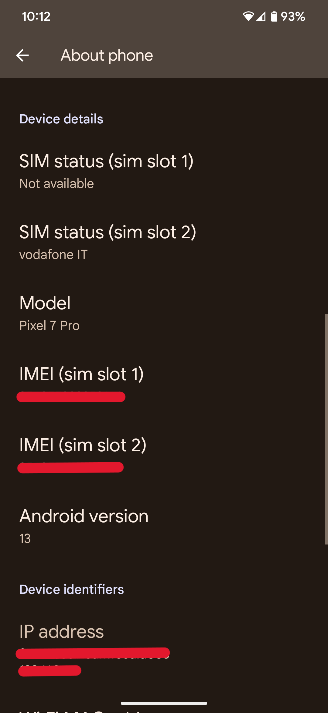 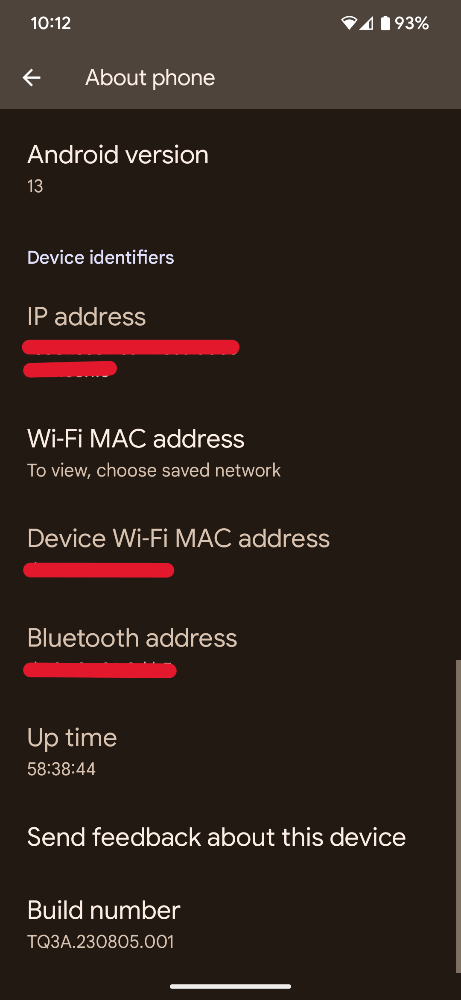

### Full PoC video

### PoC step-by-step using screenshots

1. Open any app; in this PoC the **`Brave`** browser app was chosen:

   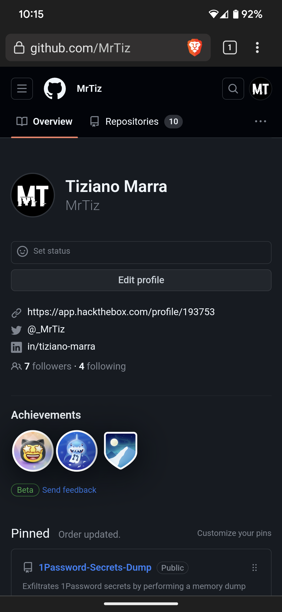

2. Pin the app:

    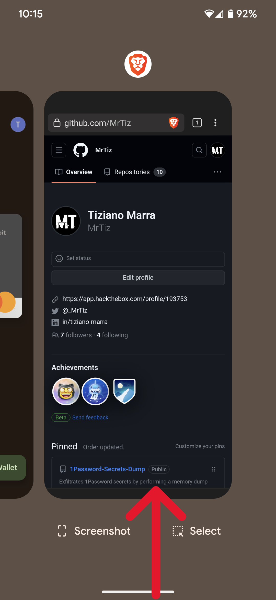 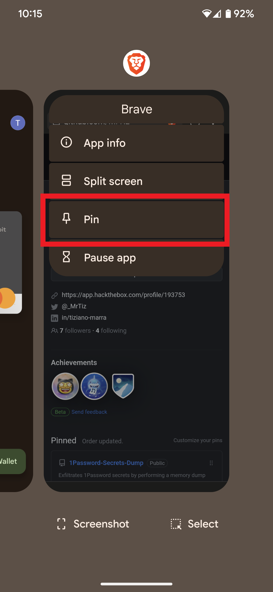
    
    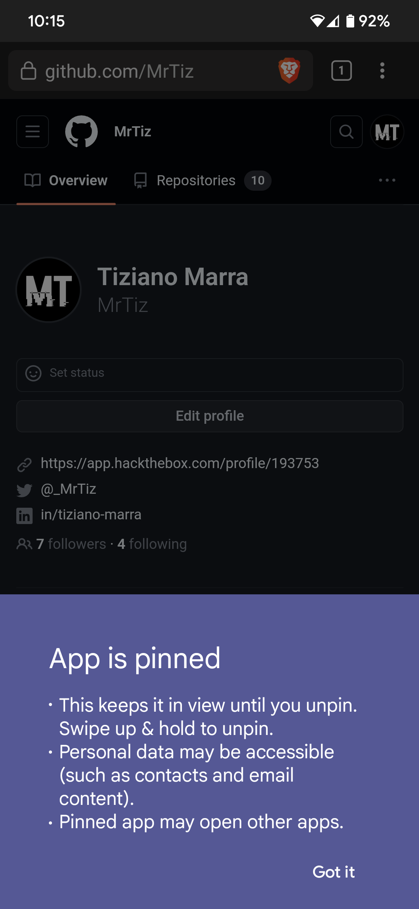 

3. Now unpin the app by performing the same action (_Swipe up & hold_) you would perform if you wanted to view the "[Recents screen](https://developer.android.com/guide/components/activities/recents)" list; the Android lock screen will open, prompting you to unlock the device via one of the enabled lock methods:

    

4. You can now use the **Flipper Zero** device to read the payment card data registered in Google Wallet:

    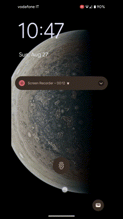
    
    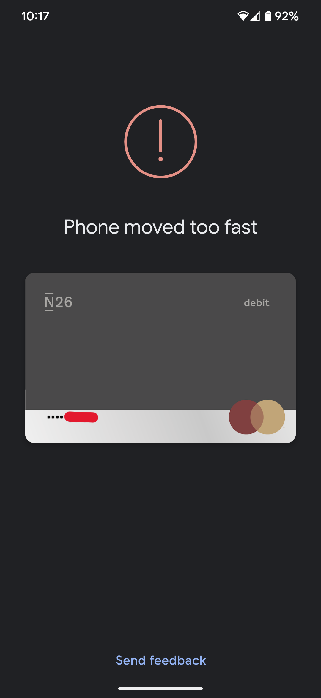 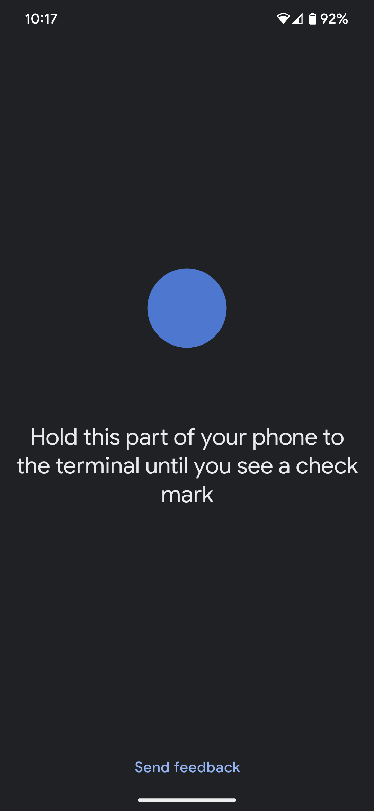

    

**N.B.** if a real P.O.S. (Point Of Sale) had been used instead of the Flipper Zero, the smartphone would have made an unauthorized payment because the smartphone was not unlocked (the `Require device unlock for NFC` option is enabled).

# Documentation
- [CVE-2023-35671](https://nvd.nist.gov/vuln/detail/CVE-2023-35671)
- [Patch](https://android.googlesource.com/platform/packages/apps/Nfc/+/745632835f3d97513a9c2a96e56e1dc06c4e4176)
- [Bulletin](https://source.android.com/docs/security/bulletin/2023-09-01?hl=en#system)
- [Acknowledgements](https://source.android.com/docs/security/overview/acknowledgements?hl=en#september-2023)

# Authors
- **[Tiziano Marra](https://github.com/MrTiz)**

# Disclaimer
The author of that PoC (Proof of Concept) and discoverer of the vulnerability would like to clarify that all information provided in this repository is for educational and research purposes only. The author does not endorse or support the use of this information for illegal or malicious purposes in any way. The author assumes no responsibility for any unlawful use that may arise from the knowledge of this vulnerability or the use of the PoC.

Furthermore, the author disclaims any liability for any damage caused to devices, systems, or data involved in the implementation of the PoC or resulting from the application of suggested fixes or mitigation measures. Users who choose to utilize the information contained in this repository do so at their own risk, assuming full responsibility for the consequences of their actions.

It is strongly advised to use the information provided here in a controlled environment and only with explicit consent from the owners of the systems in question.

The author is committed to positively contribute to the security of information technology and encourages all users to abide by applicable laws and regulations, as well as to conduct ethical research and disclosure of vulnerabilities.

# License

This project is licensed under the GNU General Public License v3.0 - see the 
[LICENSE](https://github.com/MrTiz/CVE-2023-35671/blob/main/LICENSE) file for details.
