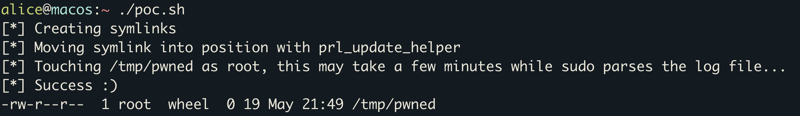

# parallels-file-move-privesc

This repository contains an exploit for CVE-2023-50226 / ZDI-CAN-21227, which can be used to escalate privileges to root using Parallels Desktop on versions before 18.3.2.

