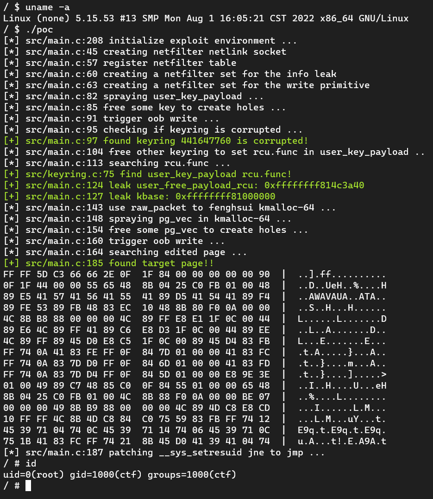

来源：https://github.com/veritas501/CVE-2022-34918

# CVE-2022-34918 LPE POC

尝试结合了一下360提出的[USMA](https://vul.360.net/archives/391)利用思路，还不错。

Chinese writeup: https://veritas501.github.io/2022_08_02-CVE-2022-34918%20netfilter%20%E5%88%86%E6%9E%90%E7%AC%94%E8%AE%B0/

!! **For educational / research purposes only. Use at your own risk.** !!

(poc below in under poc_keyring_normal folder)

## 参考

- https://github.com/randorisec/CVE-2022-34918-LPE-PoC

- https://randorisec.fr/crack-linux-firewall/

- https://starlabs.sg/blog/2022/06-io_uring-new-code-new-bugs-and-a-new-exploit-technique/

- https://vul.360.net/archives/391
